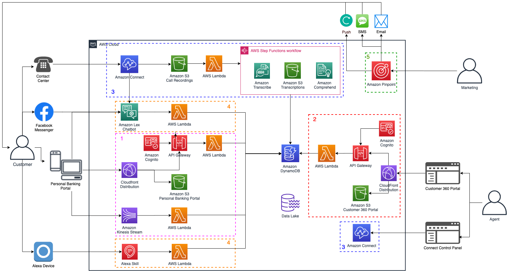

# Multichannel Customer Engagement for Financial Services on AWS

The Multichannel Customer Engagement for Financial Services on AWS unifies the usage of different user interaction channels such Amazon Alexa, Amazon Connect, Amazon Lex, conversational chatbots on Facebook Messenger and bank´s web portal, and builds a single pane of glass to have full visibility into what a user has requested or interacted using these digital tools.

At the end, you will have a ready-to-use solution to improve multichannel strategy for your organization, which can be used as it is or can be customized to meet specific business need and can be integrated to existing platforms.

## Considerations

The solution uses Amazon Connect, Amazon Alexa Skills, Amazon Lex, Amazon Transcribe, Amazon Comprehend, which are currently available in specific AWS Regions only. Therefore, you must launch this solution in an AWS Region where these services are available. For the most current service availability by region, see the [AWS service offerings by region](https://aws.amazon.com/about-aws/global-infrastructure/regional-product-services/). This solution has been successfully tested in US East (N. Virginia), and US West (Oregon).

## Getting Started 
Ready to get started ?

- [Check the pre-requisites](./deployment-guide/00_Prerequisites/README.md)
- [Go to step 1 directly](./deployment-guide/01_AmazonConnect//README.md)

## Security

See [CONTRIBUTING](CONTRIBUTING.md#security-issue-notifications) for more information.

## License

This library is licensed under the MIT-0 License. See the LICENSE file.
