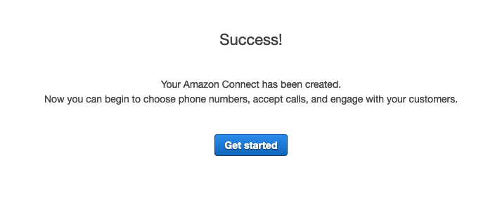

# Amazon Connect setup

The first step in setting up your Amazon Connect contact center is to create a virtual contact center instance. Each instance contains all the resources and settings related to your contact center.

If you have already an Amazon Connect instance that you want to use, then please skip this first step and move to the second part of this [lab](https://github.com/andres-lindo/aws-multichannel-customer-engagement/blob/master/labs/01_AmazonConnect/README.md#connect-to-your-amazon-connect-instance)

Search for [Amazon Connect](https://console.aws.amazon.com/connect) in your aws console 

## Setup your Connect Instance

### Step 1

1. Choose **Get started**. If you have previously created an instance, choose Add an instance instead.

2. Choose one of the following options:
   - Store users within Amazon Connect - Use Amazon Connect to create and manage user accounts.
   - Link to an existing directory - Use an AWS Directory Service directory to manage your users. You can use each directory with one Amazon Connect instance at a time.
   - SAML 2.0-based authentication - Use an existing identity provider (IdP) to federate users with Amazon Connect.

3. If you chose Store users within Amazon Connect or SAML 2.0-based authentication, provide the left-most label for Access URL. This label must be unique across all Amazon Connect instances in all Regions. You can't change the access URL after you create your instance.

4. If you chose Link to an existing directory, select the AWS Directory Service directory for Directory. The directory name is used as the left-most label for Access URL.

5. Choose **Next step**.

.png)

.png)

### Step 2: Administrator

After you specify the user name of the administrator for the Amazon Connect instance, a user account is created in Amazon Connect and the user is assigned the Admin security profile. Specify the administrator for your instance and choose **Next step**.

.png)

### Step 3: Telephony options

Use the options in this section to choose whether you want your agents to receive calls from customers, make outbound calls, and hear early media audio.

.png)

### Step 4: Data storage

When you create an instance, by default we create an Amazon S3 bucket. Data, such as reports and recordings of conversations, is encrypted using AWS Key Management Service, and then stored in the Amazon S3 bucket.

This bucket and key are used for both recordings of conversations and exported reports. Alternatively, you can specify separate buckets and keys for recordings of conversations and exported reports.

In case you want to customize it - Please see documentation [here](https://docs.aws.amazon.com/connect/latest/adminguide/amazon-connect-instances.html)

Choose **Next step**.

.png)

### Step 5: Review and create
When you are finished configuring your instance, review the configuration and click Create Instance

## Connect to your Amazon Connect Instance

### Step 1. Import the Contact Flow

Log in to your contact center using your access URL, provided by Amazon Connect (https://<your-domain>.awsapps.com/connect/login), and login with your credentials created above. Or you can just click **Get started** Button. 

1. In the left-hand menu, choose **Routing** - **Contact Flows**.

.png)

2. Create a new contact flow clicking the upper-right **Create contact flow** button

.png)

3. Choose **Save** - **Import flow**.

.png)

4. Select the Contact flow file:

#### English
- [InboundFlow_en_US](../../assets/bot-definition/amazon-connect/en_US/InboundFlow_en_US) 

#### Español
- [InboundFlow_es_US](../../assets/bot-definition/amazon-connect/es_US/InboundFlow_es_US) 

   To import, select your file, and click **Import**. When the contact flow is imported into an existing contact flow, the name of the existing contact flow is updated, too.

5. To save & publish the imported flow, choose **Save & Publish**.

NOTE - After we deploy the Cloudformation in the next step, we will come back to this contact flow to add our Amazon lex bot.

.png)

Once created, you should be seeing something similar to this flow

.png)

Please repeat the previous steps and import the following flows as well.

#### English

- [ChatFlow_en_US](../../assets/bot-definition/amazon-connect/en_US/ChatFlow_en_US)
- [Outbound_en_US](../../assets/bot-definition/amazon-connect/en_US/OutboundCall_en_US)

#### Español

- [ChatFlow_es_US](../../assets/bot-definition/amazon-connect/es_US/ChatFlow_es_US)

Click - **show additional flow information**, open a notepad and grab the InstanceID and FlowID and save them for later.

.png)

### Step 2. Configure your phone number

After you create an Amazon Connect instance, you can claim a phone number to use for your contact center. You can use this phone number to place a test call in to your contact center to confirm that it is working correctly. You can also use it in your production environment.

To claim a number for your contact center:

1. Go  **Routing** and then **Phone numbers**.

2.png)

2. Choose **Claim a number**. Select the country and choose a toll free number or a Direct Inward Dialing (DID) number.

3. Enter a description for the number and, attach it to the contact flow created in Step. 1 (It would be InboundFlow_en_US if you chose English, or InboundFlow_es_US if you chose Spanish)

2.png)

4. Choose **Save**.

Now you have a phone number for your customers to contact you.

### Step 3. Setup Queues

1. In the left-hand menu at Connect Console, go to **Routing**, then **Queues**, and then click  **BasicQueue**.

.png)

2. Assign the Outbound caller ID to the queue

.png)

3. Click in **Show additional queue information** and copy/paste the queueID on the same notepad

.png)

You are now ready to go to step 2 : [Deploy CloudFormation](../02_CloudFormation/README.md)
