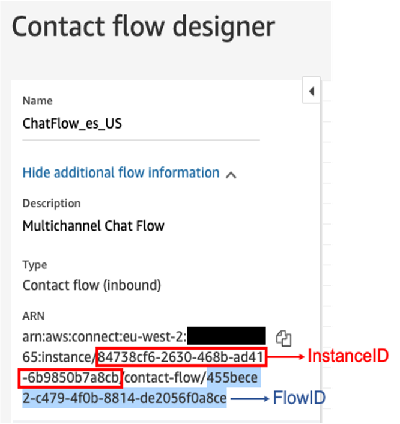
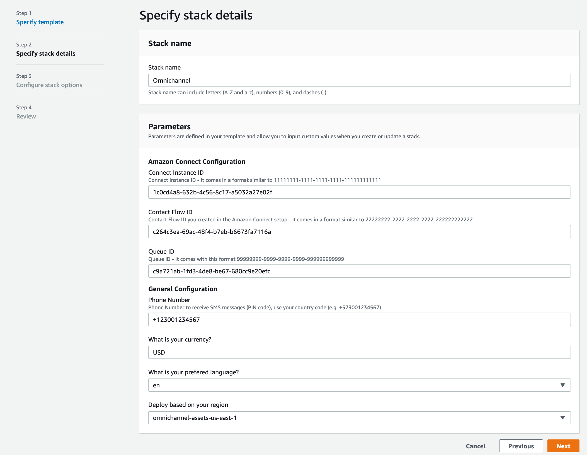
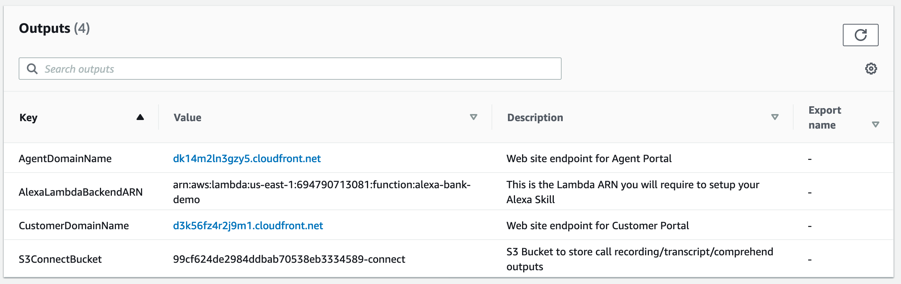
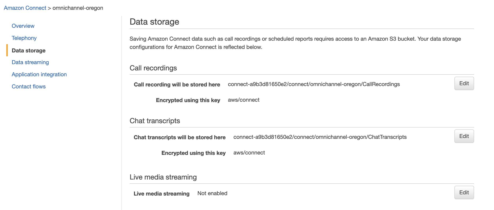

# Deploy CloudFormation template 

Before you launch this template, you must have an existing Amazon Connect instance. If you don’t have an existing Amazon Connect instance, see Step 1.

## Find Your Amazon Connect Instance ID, Contact Flow ID and Queue ID

This solution requires an Amazon Connect InstanceId, QueueId and ContactFlowId. Use this procedure to find them.
In the AWS Management Console, navigate to the [Amazon Connect](https://console.aws.amazon.com/connect) console and go to **Routing** - **Contact Flows**, select the "InboundFlow_en_US" or "InboundFlow_es_US" and click on **Show additional flow information** link.

**Connect Instance ID**: This is the id of the Amazon Connect instance you want to use. You can find this on the Amazon Connect console or when viewing the contact flow. 

> For example, if the ARN for your flow is ```arn:aws:connect:us-west-2:123456789012:instance/11111111-1111-1111-1111-111111111111/contact-flow/22222222-2222-2222-2222-222222222222```, the Connect Instance ID is ```11111111-1111-1111-1111-111111111111```

**Chat Flow ID**: 

> For example, if the ARN for your flow is ```arn:aws:connect:us-west-2:123456789012:instance/11111111-1111-1111-1111-111111111111/contact-flow/22222222-2222-2222-2222-222222222222```, the Chat Flow ID is ```22222222-2222-2222-2222-222222222222```



Then, go to **Routing** - **Queues**, select **Basic Queue**, click **Show additional queue information**

**Queue ID**: 

> For example, if the ARN for your queue is ```arn:aws:connect:us-east-1:684859963665:instance/11111111-1111-1111-1111-111111111111/queue/99999999-9999-9999-9999-999999999999``` the queue id is ```99999999-9999-9999-9999-999999999999```

Keep these values to be used in further steps.

## Launching your CloudFormation stack

Region name | Region code | Launch
--- | --- | ---
US East (N. Virginia) | us-east-1 | [](https://us-east-1.console.aws.amazon.com/cloudformation/home#/stacks/new?stackName=MultiChannelCustomerEngagement&templateURL=https://multichannel-customer-engagement-us-east-1.s3.amazonaws.com/cloudformation/mainTemplate.yaml)
US West (Oregon) | us-west-2 | [](https://us-west-2.console.aws.amazon.com/cloudformation/home#/stacks/new?stackName=MultiChannelCustomerEngagement&templateURL=https://multichannel-customer-engagement-us-west-2.s3.amazonaws.com/cloudformation/mainTemplate.yaml)
EU (Frankfurt) | eu-central-1 | [](https://eu-central-1.console.aws.amazon.com/cloudformation/home#/stacks/new?stackName=MultiChannelCustomerEngagement&templateURL=https://multichannel-customer-engagement-eu-central-1.s3.eu-central-1.amazonaws.com/cloudformation/mainTemplate.yaml)
Asia Pacific (Singapore) | ap-southeast-1 | [](https://ap-southeast-1.console.aws.amazon.com/cloudformation/home#/stacks/new?stackName=MultiChannelCustomerEngagement&templateURL=https://multichannel-customer-engagement-ap-southeast-1.s3.amazonaws.com/cloudformation/mainTemplate.yaml)  

.png)

## Set parameters

Parameter | Description |
--- | --- | 
**Connect Instance ID** | Amazon Connect - Instance ID |
**Chat Flow ID**| Amazon Connect - Basic Chat Flow ID |
**Queue ID**| Amazon Connect - Queue ID |
**Phone Number** | Phone number to send SMS notifications |
**Currency** | [ISO Currency Code](https://en.wikipedia.org/wiki/ISO_4217#Active_codes) to use in the solution |
**Language** | Language to be used by Amazon Lex and Alexa Skill (English or Spanish) |
**S3 Bucket** | Bucket where all resources for the solution deployment are hosted. Select according to the region you are deploying to |




## Create stack

Deployment can take about 15 - 20 to complete

.png)

## Outputs 

After stack creation is complete, go to the **Outputs** tab and get the values.

Key | Value |
--- | --- | 
**AgentDomainName** | Web Portal for Contact Center Agents |
**AlexaLambdaBackendARN** | Lambda ARN that supports the Alexa backend |
**CustomerDomainName** | Web Portal for Customers |
**S3ConnectBucket** | S3 Bucket that will be used to store Amazon Connect recordings and transcripts. |




> After deploying the stack if you see an S3 permission error when viewing the web portal urls, it means the domain is not ready yet. The CDN can take up to an hour to be ready. Be patient and meawhile continue with the next steps.

.png)


---
# Amazon Connect Post-Configuration

## Configure Lex in the contact flow

In the AWS Management Console, navigate to the [Amazon Connect](https://console.aws.amazon.com/connect) console, select you Instance and go to **Contact Flows**

.png)

.png)

Add the Lex Bot **"multichannel_lex_bot"**

.png)

Go to the **InboundFlow** Contact Flow created previously

.png)

Select the box **Get Customer Input**

.png)

 Go to tab **Amazon Lex** and select the **multichannel_lex_bot**

.png)

**Save** and **Publish** the Contact Flow.

Now go to the **InboundFlow** Contact Flow select the box **Get Customer Input** and set the Lex Bot in the same way as previous step

.png)

**Save** and **Publish** the Contact Flow

## Configure the Data storage

1. Go to CloudFormation - outputs and you should see S3ConnectBucket. Go to the Amazon Connect Console, select you Instance and go to **Data storage** - **Call recordings** - **Call recording will be stored here** and click **Edit**

**Enable call recordings**, select the S3ConnectBucket name from the CloudFormation output and set **Path prefix** to **CallRecordings**

**Enable chat transcripts**, select the S3ConnectBucket name from the CloudFormation output and set **Path prefix** to **ChatTranscripts**

**Save** the changes.



You are now ready to continue with step 3: [Alexa Skill setup](../03_AlexaSkill/README.md)
