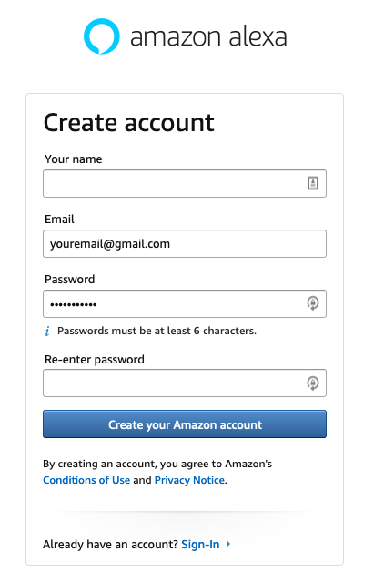
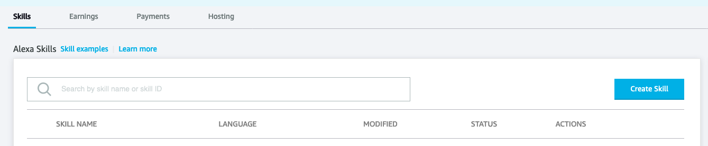
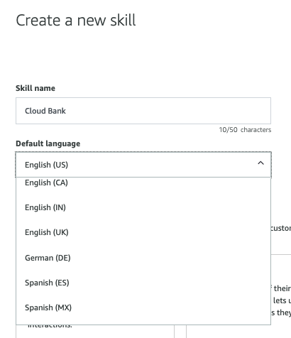
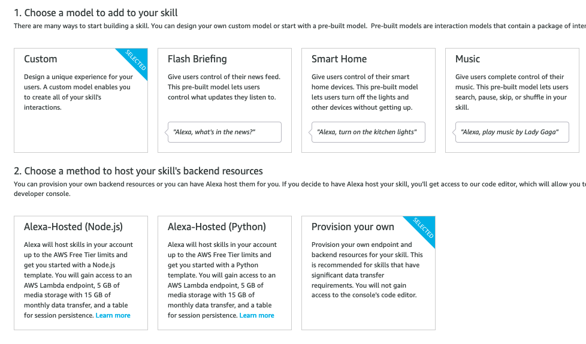
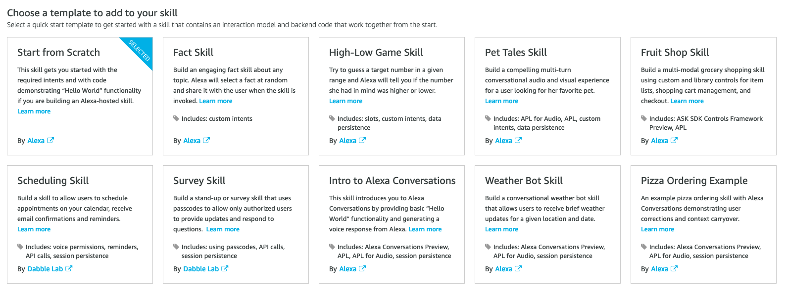
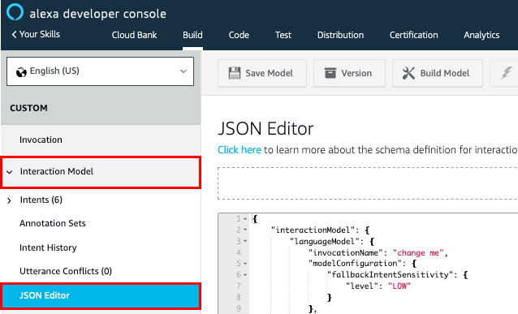
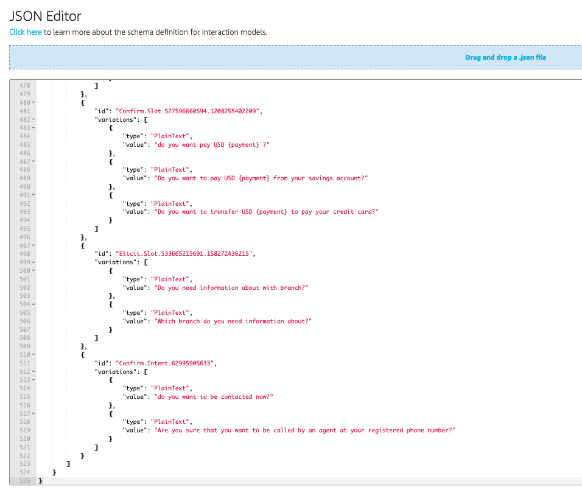
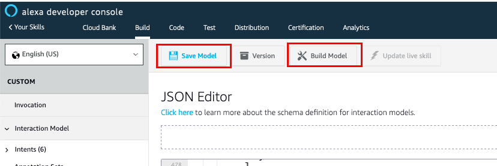
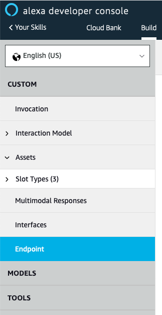

# Alexa Skill Configuration

The Omnichannel architecture includes Alexa Skills as one of the channels that enables the customers to communicate with Cloud Bank. In this guidance you will create an Alexa Skill, and you will setup this skill to have the same interaction model that already have with Amazon Lex, this Lex bot was deployed with the cloudformation template from the previous step. 

## Create Alexa Skill

1. Go to the [Alexa Developer Console](https://developer.amazon.com/alexa/console/ask)

2. If you don't already have an account, you will be able to create a new one for 
free. Note it's not the same account for amazon.com. Sign in with your developer account.

3. From the Alexa Skills Console select the **Create Skill** button near the top-right of the list of your Alexa Skills.

4. Input **Skill Name**, `Cloud Bank`. This name will be use to wake-up Alexa, and it will be shown in the name list of your Alexa Skills. You can change the locale you want, but for the purpose of this Skill, we already built the interaction models for **English(US)** and **Spanish(MX)**  as the Default Language option.

5. Select the **Custom** button for the model to add to your skill and choose **Provision your own** to host your skill's backend resources, since this backend has been deployed in previous steps, and we will support the interaction with the bank through a specfic Lambda Function. Select the **Create Skill** 
button at the top right.

6. Choose "Hello World Skill" as the template to add to your skill. Click **Choose**

7. You can choose to build the Interaction Model for your skill by adding intents, 
slots and other attributes manually, however, we already use the interaction model that already was deployed in Lex in the previous steps, so what we are going to do is to re-use this to implement our Alexa Skill. 

8. On the left hand navigation panel, under the **Interaction Model**, select the **JSON Editor** tab.

9. Replace the entire code in the JSON Editor textfield with the Interaction model according to the Default Language you chose in the Step 4. [AlexaSkill English-US](./assets/en-US/alexa-skill-en-US.json) or [AlexaSkill Spanish-MX](./assets/es-MX/alexa-skill-es-MX.json).You can do it with the drag-and-drop tool in the upper-side of the JSON Editor, or manually replacing the code (Copy+Paste). After replacing the code you will see something similar to the following image:

10. Click on **Save Model** and then **Build Model**. You should notice that Intents and Slot Types will auto populate based on the JSON Interaction Model that you have now applied to your skill.

11. Now that you have the interaction model, you require to join the backend deployed in the cloudformation with your Alexa Skills. For this, you will include the Lambda Function into the endpoint cofiguration. On the left hand navigation panel, choose the **Endpoint** option, and you will the Service Endpoint Type Configuration.

Now, you will replace the Default Region ARN in the Lambda with the ARN of the Lambda deployed in the [Start lab 1 directly](./02_CloudFormation/README.md), you will have to copy the ARN from the Outputs, in this case, you will pick the one with the name: ---- . The you will have to click on **Save Endpoints** button.

12. After this 

11. If your interaction model builds successfully, you are now able to test the interaction model 