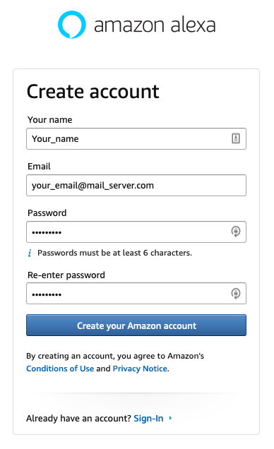
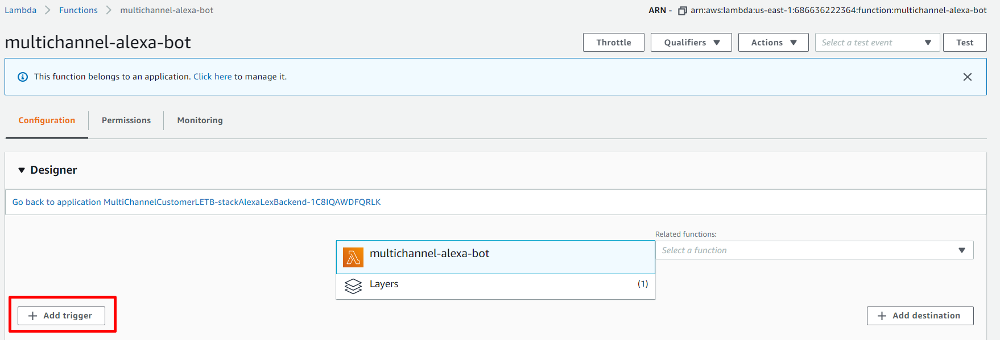
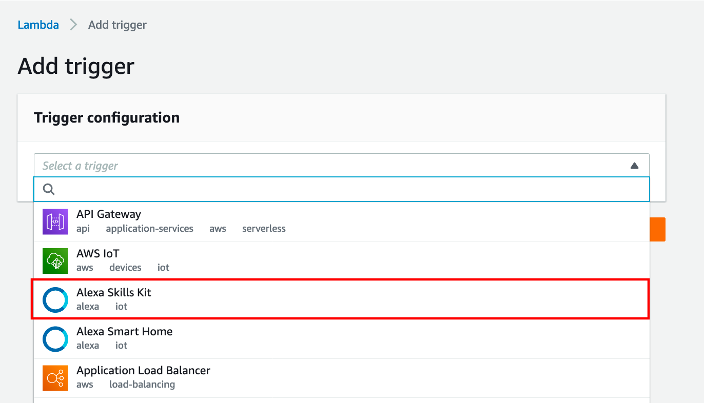
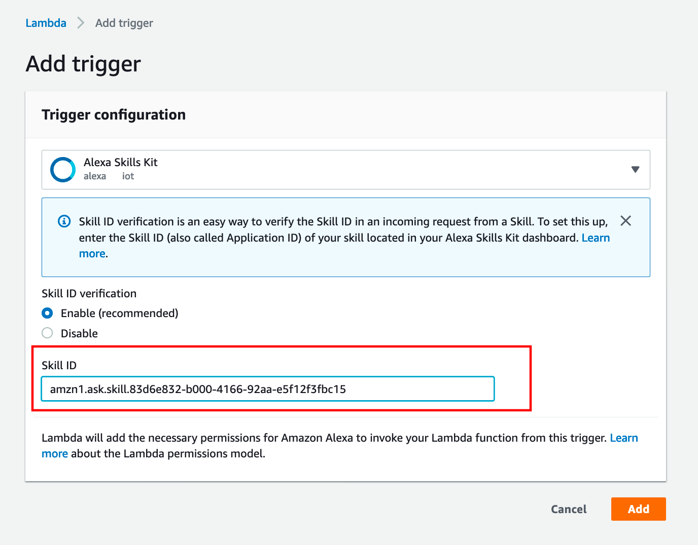
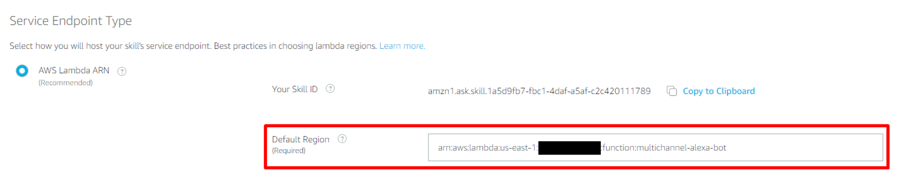
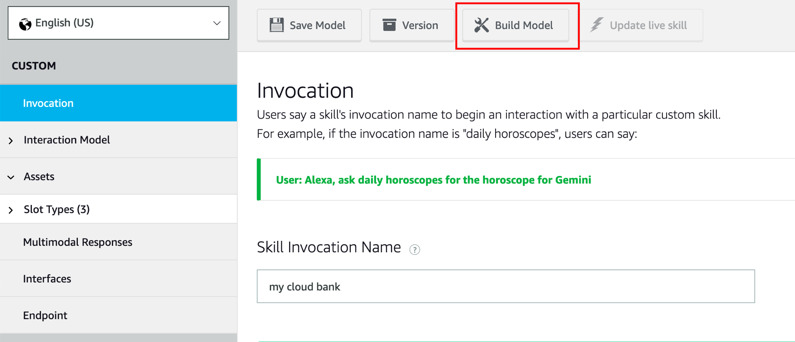

# Alexa Skill setup

The Multichannel Customer Engagement for Financial Services solution includes Alexa Skills as one of the channels that enables the customers to communicate with Cloud Bank. In this guidance you will create an Alexa Skill, and you will setup this skill to have the same interaction model that already have with Amazon Lex, this Lex bot was deployed with the cloudformation template from the previous step. 

## Create Alexa Skill

1. Go to the [Alexa Developer Console](https://developer.amazon.com/alexa/console/ask)

2. If you don't already have an account, you will be able to create a new one for 
free. Note it's not the same account for amazon.com. Sign in with your developer account.

3. From the Alexa Skills Console select the **Create Skill** button near the top-right of the list of your Alexa Skills.

4. Input **Skill Name**, `Cloud Bank`. This name will be use to wake-up Alexa, and it will be shown in the name list of your Alexa Skills. You can change the locale you want, but for the purpose of this Skill, we already built the interaction models for **English(US)** and **Spanish(MX)**  as the Default Language option.

5. Select the **Custom** button for the model to add to your skill and choose **Provision your own** to host your skill's backend resources, since this backend has been deployed in previous steps, and we will support the interaction with the bank through a specfic Lambda Function. Select the **Create Skill** 
button at the top right.

6. Choose "Start from Scratch Skill" as the template to add to your skill. Click **Choose**

7. You can choose to build the Interaction Model for your skill by adding intents, 
slots and other attributes manually, however, we already use the interaction model that already was deployed in Lex in the previous steps, so what we are going to do is to re-use this to implement our Alexa Skill. 

8. On the left hand navigation panel, under the **Interaction Model**, select the **JSON Editor** tab.

9. Replace the entire code in the JSON Editor textfield with the Interaction model according to the Default Language you chose in the Step 4. [AlexaSkill English-US](../../assets/bot-definition/amazon-alexa/alexa-skill-en-US.json) or [AlexaSkill Spanish-MX](../../assets/bot-definition/amazon-alexa/alexa-skill-es-MX.json).You can do it with the drag-and-drop tool in the upper-side of the JSON Editor, or manually replacing the code (Copy+Paste). After replacing the code you will see something similar as the following image:

10. Click on **Save Model** and then **Build Model**. You should notice that Intents and Slot Types will auto populate based on the JSON Interaction Model that you have now applied to your skill.

## Configure Alexa Skill backend

11. Now that you have the interaction model, you require to join the backend deployed in the cloudformation with your Alexa Skills. For this, you will include the Lambda Function into the endpoint cofiguration. On the left hand navigation panel, choose the **Endpoint** option, and you will the Service Endpoint Type Configuration.

12. Copy your Skill ID, you will need this to setup your Lambda Triggers, you can click the **Copy to Clipboard** button. 

13. Into another browser tab, open your **AWS Console**, then search for the **AWS Lambda** services, after this look for the **multichannel-alexa-bot** Lambda Function. It will open the function console editor, then click into the **Add Trigger** button to enable your Alexa Skill call the Lambda Function.

15. In the **Trigger Configuration**, select the **Alexa Skill Kit** option

16. Paste the Alexa Skill ID copied in the **Step 12**.

17. Go back to the **Alexa Developer Console** and replace the **Default Region ARN** with the Lambda ARN created during the [step 2: Deploy Cloudformation](./02_CloudFormation/README.md), copy the **AlexaLambdaBackendARN** from the [Outputs](../02_CloudFormation/README.md#outputs). Finally, Click on **Save Endpoints** button in the upper menu.

18. After making this changes, go to **Invocation** and then click **Build Model**, It will take around 5 mins to finish, after this you are  able to test your Alexa Skill.

You are now ready to go to step 4 : [Integrating your Amazon Lex Bot with Facebook Messenger](../04_FacebookMessenger/README.md)