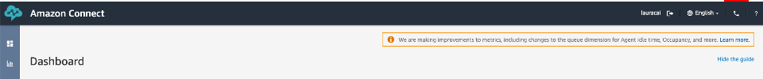

# Using the solution

## Example 1 - Interact with the bot and simulate clickstreaming

1. Go to CloudFormation - outputs and you should see 2 URLs: AgentDomainName	and CustomerDomainName

2. Go to the open CustomerDomainName's Url. Please sign up with a valid email. It opens the banking portal.

3. Let's emulate a few clicks that an user can do on the page, you can click on the following buttons to capture the clickstreams.

.png)

4. Next, click on "Cloud Bank Bot" and start interacting with the chatbot powered by Amazon Lex. These are some examples of questions: 
 - What is my savings account balance?
 - I need an cash advance
 - how much do I owe in my credit card
 - credit card due date
 - pay balance of my credit card
 - what are the openning hours for the new york branch

    Y   ou can also go to Amazon Lex and check the different intents configured.

    Every interaction is going to request a PIN (except for the questions about the branches openning hours). You can request to send a pin (Just type *send me a pin*), it will send a PIN to the mobile phone configured in the CloudFormation, or you can also check it at the top right of the website.

5. Now let's interact using Amazon Connect. Go and log in into your Amazon Connect Instance. Open the Connect Agent Control Panel - you can click in the phone icon.

    you should see a portal like this

.png)

    Make sure you are set as Available

.png)

6. Without closing the CCP - Go back to your CustomerDomainName portal and in the chat type *I would like to speak with an agent* or *talk to an agent* - This should innitiate a new chat incoming in the CCP.

.png)

7. Accept the chat - now your agent is chatting with the end user in the banking portal.

## Example 2 - Interact using Contact Center powered by Amazon Connect

1. Call the phone number you configure in Lab 1 - Step 3. 

2. when prompted dial 2. FAQ. Now you can ask the same questions than in the previous example 
 - What is my savings account balance?
 - I need an cash advance
 - how much do I owe in my credit card
 - credit card due date
 - pay balance of my credit card
 - what are the openning hours for the new york branch
 
 It will also require PIN for specific account questions - you need to type it.
 
 3. Then choose option #3 - It will redirect your call to an agent, if your agent is set as available, it then will forward the call and it should be ringing.
 
 4. In order to test Call Analytics - Please hold a call where you simulate agent/call between two people.

 
 ## Example 3 - Interact using Alexa

 If you deployed the step - AlexaSkill. Then please interact with Alexa, you can use the developer test console, saying "Alexa, open my cloud bank" or "Alexa, abre banca nube" for spanish, and then ask some of the same questions.

Remember you can say, Alexa, send me a pin and it will send you a PIN to the mobile phone configured in the cloudformation.

 - What is my savings account balance?
 - I need an cash advance
 - how much do I owe in my credit card
 - credit card due date
 - pay balance of my credit card
 - what are the openning hours for the new york branch
 
 
 ## Analyze all Data

 Now that you have some calls recorded, that we have interacted with Lex using voice and text and with Alexa. Also, we emulated some clickstreaming, let's log in the agent portal to visualise all the different data.

1. Go to CloudFormation - outputs and you should see 2 URLs: AgentDomainName and CustomerDomainName.

2. Go to the open CustomerDomainName's Url. Please sign in (if register in example #1) or sign up with a valid email. It opens the agent portal.

3. Now, you can see all the voice, bot, and other interaction we just created.